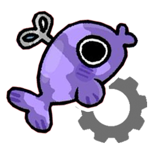

<h1 align="center">

<br>
AutoBarnaby
<br>
<small>An Automatic Swimmy Barnaby Beater</small>
</h1>

 

Tired of losing ichor trying to clear 100 stages of Swimmy Barnaby in Dandy's World?

AutoBarnaby is the macro bot for you.

Built entirely in Java with zero external dependencies, AutoBarnaby is a lightweight, efficient bot designed to automate the Swimmy Barnaby mini-game.

And before you ask: **It is not an exploit, cheat, or hack**. It also **does not collect any data**, so you can rest assured that you won't get banned, or have your account stolen. To Roblox, this is just a normal program that clicks on your screen. Additionally, macro-ing is not against Dandy's World or Roblox's rules (as opposed to exploiting).

AutoBarnaby has been tested to work on Windows, and theoretically should work on MacOS and Linux, but mobile support is not added nor planned.

Finn must have his default skin equipped for the bot to work, as it is configured to detect Barnaby's default colors.

> Additionally, this program assumes your screen is exactly **1920x1080** with 100% UI scaling, and that the game is running on fullscreen on your primary monitor. If your setup differs, you need to either change your monitor's display settings to these, or modify the constants in the source code to your screen's dimensions. In the future, this program may be updated to automatically scale to any screen resolution, but for now, it is hardcoded to these values.

<small>Feel free to showcase AutoBarnaby in your content, or share it around! All I ask is to credit this project.</small>

---

*Note: The bot performs well enough to reach stage 100 consistently, though not always on the first attempt. The current configuration is the result of limited practical testing, so there is still room for improvement. If you'd like to help refine it, you're encouraged to experiment with the internal constant values and submit a pull request (or open an issue) with your findings. Any contributions are greatly appreciated. <small>If it wasn't for the 25 ichor cost to test the bot in a real game, this would have already been optimized much further!*</small>

## 🐟 Downloading and Running the Bot

1\. Head over to the [Releases](https://github.com/HenriqueRadical/auto-barnaby/releases) page and download the latest `AutoBarnaby.jar` file. No installation is required, just run the `.jar`!

> Make sure you have Java installed on your system. You can download it from [here](https://www.java.com/en/download/).

Alternatively, you can run it by opening a terminal window in the folder containing the `.jar` and running the following command: `java -jar AutoBarnaby.jar`

2\. Once the terminal is open, simply type `s` to start the bot!

> Start AutoBarnaby **before** you start the game. Then, fullscreen the game window on your primary monitor and press play, keeping your mouse over Roblox. The bot will automatically begin playing.

## 🌿 Building from Source

If you want to modify the code, tune the engine variables, or compile the bot yourself:

1\. Ensure you have the **Java Development Kit (JDK)** installed.

2\. Clone the repository to your local machine:
```bash
git clone https://github.com/HenriqueRadical/AutoBarnaby.git
```
3\. Enter the cloned directory and run `compile.bat` (windows) or `compile.sh` (Mac/Linux) to compile the source code into a `.jar` file.

4\. Run the generated `AutoBarnaby.jar` as described in the previous section.

## ⚠️ Troubleshooting

* **Bot isn't clicking/seeing the fish?** AutoBarnaby is hardcoded to specific screen coordinates. If your monitor resolution or UI scaling is different, you may need to update the `TOP_Y`, `BOTTOM_Y`, `TOP_LEFT_X`, etc., constants at the top of the `AutoBarnaby.java` file to match your screen's exact game board dimensions.
* **Crashing?** If the program encounters a fatal error, it will generate a `crash_log.txt` file in the same directory. Open this file to see the exact Java stack trace, and feel free to open an issue or submit a pull request with a fix!
* **Something else?** Open an issue on the GitHub repository and I'll try to help you out.

## 📜 Credits

A big thank you to [itsmarsss/auto-flappy](https://github.com/itsmarsss/auto-flappy) for the original conceptual inspiration for computer-vision-based gameplay automation. AutoBarnaby builds upon this foundation with completely custom 3D perspective mapping and optimized single-anchor targeting for the Swimmy Barnaby environment.
